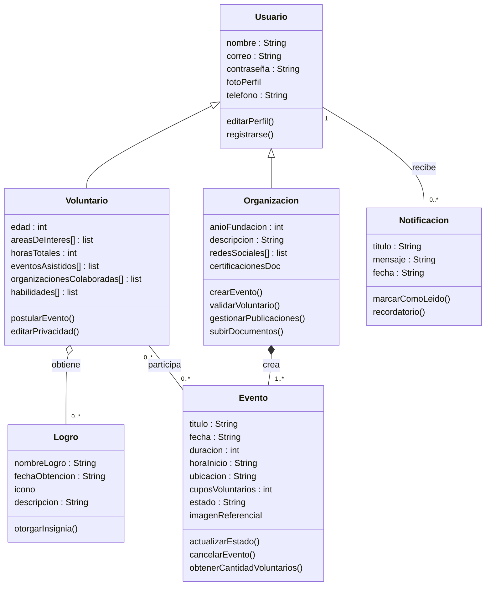

# Kellun

## Descripción del sistema
Para las personas interesadas en hacer voluntariados, no es fácil encontrar un espacio accesible para buscar de manera centralizada eventos a beneficencia confiables y cerca de tu zona geográfica. Para eso es el proyecto Kellun, el cual permite solucionar el problema de manera intuitiva y sin complicaciones, permitiendo a los voluntarios registrados acceder a información de voluntariados cerca de su zona y ver detalles del mismo, tales como: información sobre el evento, número de personas participantes y requerimientos para postularse, entre otros; permitiéndole inscribirse para participar en el evento.

Como organización dedicada a la búsqueda de voluntarios, el alcance suele depender del boca a boca y de las redes sociales. Con Kellun, podrás conectar directamente con personas genuinamente interesadas en hacer voluntariado, accediendo a perfiles detallados e historial de cada postulante.
Además, la plataforma pone a tu disposición un portal intuitivo para gestionar la aceptación de voluntarios, permitiéndote establecer requisitos de ingreso personalizados: documentos, rango de edad, intereses y habilidades específicas según las necesidades de tu organización.

## Historias de Usuario
Todas las historias están registradas como GitHub Issues.

| ID    | Nombre                                         | Issue                                                                   |
| ----- | ---------------------------------------------- | ----------------------------------------------------------------------- |
| US-01 | Registro nuevos voluntarios                    | [#13](https://github.com/proyecto-kellun-2026/Kellun-project/issues/13) |
| US-02 | Datos de acceso                                | [#14](https://github.com/proyecto-kellun-2026/Kellun-project/issues/14) |
| US-03 | Descripción perfil voluntario                  | [#15](https://github.com/proyecto-kellun-2026/Kellun-project/issues/15) |
| US-04 | Configuración de privacidad                    | [#11](https://github.com/proyecto-kellun-2026/Kellun-project/issues/11) |
| US-05 | Logros voluntarios                             | [#9](https://github.com/proyecto-kellun-2026/Kellun-project/issues/9)   |
| US-06 | Registro organización                          | [#16](https://github.com/proyecto-kellun-2026/Kellun-project/issues/16) |
| US-07 | Validación perfil organización                 | [#17](https://github.com/proyecto-kellun-2026/Kellun-project/issues/17) |
| US-08 | Búsqueda de voluntariados por ubicación        | [#18](https://github.com/proyecto-kellun-2026/Kellun-project/issues/18) |
| US-09 | Búsqueda de voluntariados por tipo             | [#19](https://github.com/proyecto-kellun-2026/Kellun-project/issues/19) |
| US-10 | Requisitos exigidos a voluntarios              | [#6](https://github.com/proyecto-kellun-2026/Kellun-project/issues/6)   |
| US-11 | Cantidad de voluntarios necesarios             | [#20](https://github.com/proyecto-kellun-2026/Kellun-project/issues/20) |
| US-12 | Duración voluntariado                          | [#21](https://github.com/proyecto-kellun-2026/Kellun-project/issues/21) |
| US-13 | Publicación de nuevos eventos                  | [#22](https://github.com/proyecto-kellun-2026/Kellun-project/issues/22) |
| US-14 | Categorización de eventos por habilidades      | [#23](https://github.com/proyecto-kellun-2026/Kellun-project/issues/23) |
| US-15 | Visualización de agenda confirmada             | [#24](https://github.com/proyecto-kellun-2026/Kellun-project/issues/24) |
| US-16 | Gestión de historial de postulaciones          | [#25](https://github.com/proyecto-kellun-2026/Kellun-project/issues/25) |
| US-17 | Postulación a eventos                          | [#26](https://github.com/proyecto-kellun-2026/Kellun-project/issues/26) |
| US-18 | Resolución de postulaciones                    | [#27](https://github.com/proyecto-kellun-2026/Kellun-project/issues/27) |
| US-19 | Notificación de aceptación de postulación      | [#28](https://github.com/proyecto-kellun-2026/Kellun-project/issues/28) |
| US-20 | Historial de notificaciones                    | [#29](https://github.com/proyecto-kellun-2026/Kellun-project/issues/29) |
| US-21 | Recordatorio de evento próximo                 | [#30](https://github.com/proyecto-kellun-2026/Kellun-project/issues/30) |
| US-22 | Notificación automática por cambios en eventos | [#31](https://github.com/proyecto-kellun-2026/Kellun-project/issues/31) |

## Requisitos Extrafuncionales
Ver: [ReqExtrafuncionales.md](./ReqExtrafuncionales.md)

## Entidades del Dominio

### Entidad Usuario:
#### Atributo
- nombre: String
- correo: String
- contraseña: String
- fotoPerfil
- telefono: String
#### Operaciones
- editarPerfil
- registrarse
### Entidad Voluntario (Usuario):
#### Atributo
- edad: int
- areasDeInteres[]: list
- horasTotales: int
- eventosAsistidos[]: list
- organizacionesColaboradas[]: list
- habilidades[]: list
#### Operaciones
- postularEvento
- editarPrivacidad

### Entidad Organización (Usuario):
#### Atributo
- anioFundacion: int
- descripcion: : String
- redesSociales[]: list
- certificacionesDoc
#### Operaciones
- crearEvento
- validarVoluntario
- gestionarPublicaciones
- subirDocumentos

### Entidad Evento:
#### Atributo
- titulo: String
- fecha: String
- duracion: int
- horaInicio: String
- ubicacion: String
- cuposVoluntarios: int
- estado: String
- imagenReferencial
#### Operaciones
- actualizarEstado
- cancelarEvento
- obtenerCantidadVoluntarios

### Entidad Notificación:
#### Atributo
- titulo: String
- mensaje: String
- fecha: String
#### Operaciones
- marcarComoLeido
- recordatorio

### Entidad Logro:
#### Atributo
- nombreLogro: String
- fechaObtencion: String
- icono
- descripcion: String
#### Operaciones
- otogarInsignia

| **Relación**                                                | **Tipo de Relación** | **Cardinalidad** |
| ----------------------------------------------------------- | -------------------- | ---------------- |
| **Usuario (Padre) $\rightarrow$ Voluntario / Organización** | **Herencia**         | 1:1              |
| **Organización $\rightarrow$ Evento**                       | **Composición**      | 1:N              |
| **Voluntario $\rightarrow$ Logro**                          | **Agregación**       | 1:N              |
| **Voluntario $\leftrightarrow$ Evento**                     | **Asociación**       | N:M              |
| **Usuario $\rightarrow$ Notificación**                      | **Asociación**       | 1:N              |

## Mockups
| Mockup                          | Historia de usuario relacionada          |
| ------------------------------- | ---------------------------------------- |
| [Mockup 1](./img/Mockups-1.png) | US-01, US-02                             |
| [Mockup 2](./img/Mockups-2.png) | US-03, US-04, US-05                      |
| [Mockup 3](./img/Mockups-3.png) | US-06                                    |
| [Mockup 4](./img/Mockups-4.png) | US-07                                    |
| [Mockup 5](./img/Mockups-5.png) | US-09, US-10, US-11, US-12, US-14, US-17 |
| [Mockup 6](./img/Mockups-6.png) | US-13                                    |
| [Mockup 7](./img/Mockups-7.png) | US-19, US-20, US-21, US-22               |
| [Mockup 8](./img/Mockups-8.png) | US-15, US-16, US-18                      |

## Diseño Arquitectónico
Ver: [Arquitectura.md](./Arquitectura.md)

## Responsabilidades del Equipo
| Integrante       | Rol           | Ítems de la rúbrica a cargo |
| ---------------- | ------------- | --------------------------- |
| Felipe Rojas     | Scrum Master  | [1.1-1.2-2.1-2.4]           |
| Raúl Sepúlveda   | Product Owner | [1.2-2.1]                   |
| Javiera Guerrero | Developers    | [1.1-1.2-2.1-2.2-2.3]       |
| Paulo González   | Developers    | [1.1-2.2-2.3]               |
| Felipe Ossándon  | Developers    | [1.1-1.2-2.4]               |

# Entrega 2

## Responsabilidades del equipo
| Integrante | Rol | Ítems de la rúbrica a cargo |
|------------|-----|----------------------------|
| Felipe Ossandón  | Developer | [Todos]        |
| Felipe Rojas     | Scrum Master |  [2, 3 y 4] |
| Javiera Guerrero | Developer | [Todos]        |
| Raúl Sepúlveda   | Product Owner | [Todos]    |

## Historias de usuario
[Primer chat con Clarita Review](https://chatgpt.com/share/6a1ecfbf-f554-83e9-a2b6-d0072a8586b1)  

Actualización con el [feedback de Clarita Review](https://chatgpt.com/share/6a1e3aa1-227c-83ea-950b-4148bcea5990)
| ID | Nombre | Estado | Issue |
| ----- | ---------------------------------------------- | -------------------------------------------------------------------- | ----------------------------------------------------------------------- |
| US-01 | Registro de voluntario                         | Fusionada con US-02, mejorada con feedback de Clarita Review         | [#13](https://github.com/proyecto-kellun-2026/Kellun-project/issues/13) |
| US-02 | Datos de acceso                                | Eliminada, fusionada con US-01                                       | [#14](https://github.com/proyecto-kellun-2026/Kellun-project/issues/14) |
| US-03 | Descripción perfil voluntario                  | Sin cambios                                                          | [#15](https://github.com/proyecto-kellun-2026/Kellun-project/issues/15) |
| US-04 | Configuración de privacidad                    | Sin cambios                                                          | [#11](https://github.com/proyecto-kellun-2026/Kellun-project/issues/11) |
| US-05 | Logros voluntarios                             | Sin cambios                                                          |   [#9](https://github.com/proyecto-kellun-2026/Kellun-project/issues/9) |
| US-06 | Registro organización                          | Sin cambios                                                          | [#16](https://github.com/proyecto-kellun-2026/Kellun-project/issues/16) |
| US-07 | Validación perfil organización                 | Sin cambios                                                          | [#17](https://github.com/proyecto-kellun-2026/Kellun-project/issues/17) |
| US-08 | Búsqueda de voluntariados por ubicación        | Mejorada con feedback de Clarita Review                              | [#18](https://github.com/proyecto-kellun-2026/Kellun-project/issues/18) |
| US-09 | Búsqueda de voluntariados por tipo             | Sin cambios                                                          | [#19](https://github.com/proyecto-kellun-2026/Kellun-project/issues/19) |
| US-10 | Requisitos exigidos a voluntarios              | Fusionada con US-14, mejorada con feedback de Clarita Review         |   [#6](https://github.com/proyecto-kellun-2026/Kellun-project/issues/6) |
| US-11 | Cantidad de voluntarios necesarios             | Fusionada con US-12 y US-13, mejorada con feedback de Clarita Review | [#20](https://github.com/proyecto-kellun-2026/Kellun-project/issues/20) |
| US-12 | Duración voluntariado                          | Eliminada, fusionada con US-11                                       | [#21](https://github.com/proyecto-kellun-2026/Kellun-project/issues/21) |
| US-13 | Publicación de nuevos eventos                  | Eliminada, fusionada con US-11                                       | [#22](https://github.com/proyecto-kellun-2026/Kellun-project/issues/22) |
| US-14 | Categorización de eventos por habilidades      | Eliminada, fusionada con US-10                                       | [#23](https://github.com/proyecto-kellun-2026/Kellun-project/issues/23) |
| US-15 | Visualización de agenda confirmada             | Sin cambios                                                          | [#24](https://github.com/proyecto-kellun-2026/Kellun-project/issues/24) |
| US-16 | Gestión de historial de postulaciones          | Sin cambios                                                          | [#25](https://github.com/proyecto-kellun-2026/Kellun-project/issues/25) |
| US-17 | Postulación a eventos                          | Sin cambios                                                          | [#26](https://github.com/proyecto-kellun-2026/Kellun-project/issues/26) |
| US-18 | Resolución de postulaciones                    | Sin cambios                                                          | [#27](https://github.com/proyecto-kellun-2026/Kellun-project/issues/27) |
| US-19 | Notificación de aceptación de postulación      | Sin cambios                                                          | [#28](https://github.com/proyecto-kellun-2026/Kellun-project/issues/28) |
| US-20 | Historial de notificaciones                    | Sin cambios                                                          | [#29](https://github.com/proyecto-kellun-2026/Kellun-project/issues/29) |
| US-21 | Recordatorio de evento próximo                 | Sin cambios                                                          | [#30](https://github.com/proyecto-kellun-2026/Kellun-project/issues/30) |
| US-22 | Notificación automática por cambios en eventos | Sin cambios                                                          | [#31](https://github.com/proyecto-kellun-2026/Kellun-project/issues/31) |

## Prueba API-Logros:

[Prueba: Edición de datos](/img/Pruebas_APIlogros/Actualizacion%20de%20dato%20exitosa.png)

[Prueba: Eliminación de logro](/img/Pruebas_APIlogros/Eliminacion%20de%20logro%20exitoso.png)

[Prueba: Entrega de logros](/img/Pruebas_APIlogros/Entrega%20de%20lista%20de%20logros%20exitoso.png)

[Prueba: Actualización de logros que no existen](img/Pruebas_APIlogros/No%20permite%20actualizar%20logros%20no%20existentes.png)

[Prueba: Colocar datos vacios](img/Pruebas_APIlogros/No%20permite%20asignar%20a%20atributos%20de%20textos%20cadenas%20de%20caracteres%20vacia.png)

[Prueba: Ingreso de un dato de distinto tipo](img/Pruebas_APIlogros/No%20permite%20asignar%20al%20atributo%20un%20dato%20con%20tipo%20erroneo.png)

[Prueba: Ingreso de un dato extra](img/Pruebas_APIlogros/No%20permite%20crear%20logros%20con%20atributos%20extra.png)

[Prueba: Falta de atributos](img/Pruebas_APIlogros/No%20permite%20crear%20logros%20con%20atributos%20faltantes.png)

[Prueba: Duplicidad de logros](img/Pruebas_APIlogros/No%20permite%20duplicados.png)

[Prueba: Eliminación de logros no existentes](img/Pruebas_APIlogros/No%20permite%20eliminar%20logros%20no%20existentes.png)

## Prueba API-registroOrganizaciones:

[Prueba: Ingreso normal de una cuenta](/Pruebas_APIregistroOrganizaciones/)

[Prueba: Colocando una clave corta](/Pruebas_APIregistroOrganizaciones/ClaveCorta.jpeg)

[Prueba: Ingresando una contraseña vacia](/Pruebas_APIregistroOrganizaciones/ContraniaVacia.jpeg)

[Prueba: Correo ya registrado](/Pruebas_APIregistroOrganizaciones/Existente.jpeg)

[Prueba: Nombre de organización demasiado largo](/Pruebas_APIregistroOrganizaciones/NombreLargo.jpeg)

[Prueba: Nombre con solo números](/Pruebas_APIregistroOrganizaciones/NombreSinLetras)

[Prueba: Parametro extra](/Pruebas_APIregistroOrganizaciones/ParametroInventado.jpeg)

[Prueba: Correo sin dominio](/Pruebas_APIregistroOrganizaciones/SinDominio.jpeg)

[Prueba: Ingresando la letra 'ñ'](/Pruebas_APIregistroOrganizaciones/letra_enie.jpeg)

