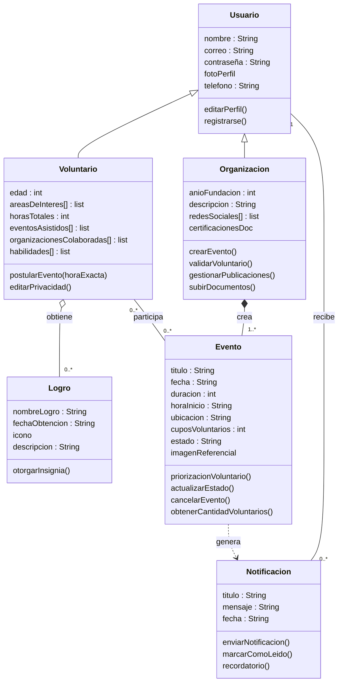

## 1. Cambio solicitado 

Cambio Funcional Solicitado: Se quiere cambiar la fiabilidad en los cambios, ya que  si un usuario queda registrado en la base de datos, se debe enviar una notificación al organizador.

## 2. Nuevas historias de usuario 

### US-23: [confirmación de asistencia] 
Como organización, 
quiero recibir una notificación de confirmación de asistencia por parte de voluntarios,
para gestionar más eficientemente el flujo de voluntarios cerca de las fechas del evento. 
 
Criterios de aceptación: 
- CA1: Dado que el voluntario confirme su asistencia, cuando el sistema registre la confirmación, entonces se debe enviar una notificación a la organización.
- CA2: Dado que el voluntariado este proximo a la fecha de realización, cuando queden 48 hrs, entonces debe notificar al voluntario.

### US-24 [Confirmacion asistencia Voluntarios]
Como voluntario,
quiero recibir una notificación que me permita confirmar mi asistencia,
para asegurar mi cupo en el voluntariado.

Criterios de aceptación: 
- CA1: Dado que la actividad cuenta con con cupos limitados, cuando confirmo mi asistencia, entonces se debe enviar una notificación que consulte si todavia deseo participar.
- CA2: Dado que deseo postular a distintos voluntariados, cuando me inscribo a cada voluntariado, entonces debo recibir una notificacion con la fecha en la que se realizara la actividad.

## 3. Impacto en requisitos extrafuncionales 
Indicar si el cambio altera la prioridad de algún REF o introduce nuevos. 
Trazar cambios de prioridad que motiven cambios en decisiones de arquitectura. 
 
| REF ID | Descripción                                                                                                                                                                                                  | Prioridad anterior | Prioridad nueva | Cambio / Motivo                                                                                              |
| ------ | ------------------------------------------------------------------------------------------------------------------------------------------------------------------------------------------------------------ | ------------------ | --------------- | ------------------------------------------------------------------------------------------------------------ |
| REF-01 | El sistema debe estar disponible el 98% del tiempo                                                                                                                                                           | Alta               | Alta            | Sin cambio                                                                                                   |
| REF-02 | Mínimo de seguridad para datos personales                                                                                                                                                                    | Media              | Media           | Sin cambio                                                                                                   |
| REF-03 | El sistema tiene que tener tiempo de navegación de máximo 1 segundo                                                                                                                                          | Alta               | Alta            | Sin cambios                                                                                                  |
| REF-04 | La aplicación debe funcionar en sistema Android o iOS                                                                                                                                                        | Media              | Media           | Sin cambio                                                                                                   |
| REF-05 | El sistema debe permitir la incorporación de cambios en módulos específicos sin afectar la funcionalidad del resto de los módulos.                                                                           | Alta               | Media           | El cambio hace que este requisito no sea tan relevante                                                       |
| REF-06 | El sistema debe adaptar su entorno operativo y visual basándose en el tipo de usuario, facilitando que este reconozca y acceda solo a las herramientas adecuadas para su tarea.                              | Media              | Alta            | Debido a la nueva funcionalidad para los voluntarios, la diferencia entre las interfaces se hace mas grande. |
| REF-07 | El equipo debe de ser de máximo 5 personas.                                                                                                                                                                  | Media              | Media           | Sin cambio                                                                                                   |
| REF-08 | El servidor debe estar alojado en AWS                                                                                                                                                                        | Media              | Media           | Sin cambios                                                                                                  |
| REF-09 | El sistema debe soportar al menos 1000 usuarios simultáneos.                                                                                                                                                 | Media              | Media           | Nuevo requisito                                                                                              |
| REF-10 | El sistema debe garantizar accesibilidad para usuarios con discapacidad visual total mediante compatibilidad con lectores de pantalla, asegurando una navegación lógica                                      | Baja               | Baja            | Sin cambio                                                                                                   |
| REF-11 | El sistema debe garantizar que los eventos de inscripción se procesen en el orden exacto en que fueron emitidos, sin tolerancia al reordenamiento, para cumplir con los cupos que se le asignan por llegada. | —                  | Alta            | Nuevo requisito                                                                                              |
 

## 4. Impacto en entidades del dominio 
Se hicieron las siguientes modificaciones:
La operacion postularEvento de la entidad Voluntario, se le agrego que use la hora exacta en que se solicita la postulacion
A la entidad Evento se le agrego la operacion de priorizacionVoluntario
A la entidad Notificacion se le agrego la operacion enviarNotificacion
Se agregaron las relaciones siguientes:
Usuario recibe Notificaciones
Eventos genera Notificaciones

## 5. Impacto en mockups 
 Mockup afectado n°7: Se necesita implementar una ventana emergente en la vista de notificaciones del voluntario, esta debe incluir: un mensaje de confirmación de participación al voluntariado postulado, tambien debe poseer dos botones (si/no) para que el voluntario seleccione. 

## 6. Impacto en arquitectura 
### 6.1 ¿Cambia el estilo arquitectónico? 
[### Sí/No] — Justificación: 
Al ingresar el nuevo requisito, el cual requiere precisión y orden de las solicitudes de postulación ingresadas, sin tolerancia de ordenamiento, nos obliga a reorganizar las prioridades de REF, debido a que Event-Driven tiene procesamiento asíncrono y no garantiza el orden, haciendo que la arquitectura anteriormente escogida ahora no sea favorable para este nuevo requisito tan importante. Para asegurar una arquitectura bien adaptada a este nuevo requisito, se escoge el estilo arquitectónico de Cliente-Servidor, ya que es el diseño que trabaja de manera más precisa las request sincrónicas sin afectar la mayoría de los REF anteriormente marcadas con prioridad Alta y el sacrificio de bajada de prioridad de REF-05 no afecta de mayor manera.

### 6.2 Relación REF (repriorizado) con decisiones de arquitectura 

| REF ID | Prioridad nueva | Decisión de arquitectura que lo aborda                                                                                                                                                                                                                                                                                                                        |
| ------ | --------------- | ------------------------------------------------------------------------------------------------------------------------------------------------------------------------------------------------------------------------------------------------------------------------------------------------------------------------------------------------------------- |
| REF-05 | Media           | La mantenibilidad del sistema ya no es tan importante debido a que ahora se necesita mayor énfasis en el orden de eventos de inscripción y hay formas de asegurar las otras REF de prioridad alta cambiando a un tipo de arquitectura Cliente-Servidor. Además hay maneras de modularizar una arquitectura Cliente-Servidor para facilitar más este requisito |
| REF-06 | Alta            | La nueva arquitectura escogida, al enfocarse en modularizar según usuario, ayudaría a la mejorar mantenibilidad del sistema                                                                                                                                                                                                                                   |

## 7. Impacto en módulos 

| Módulo                   | Tipo de impacto | Responsabilidad actualizada                                                                       | Ofrece a otros (actualizado)                                     |
| ------------------------ | --------------- | ------------------------------------------------------------------------------------------------- | ---------------------------------------------------------------- |
| Módulo 3: notificaciones | modificado      | Generar y enviar avisos, confirmaciones y notificaciones a los usuarios ante eventos relevantes.  | Alertas sobre actualizaciones, confirmaciones y nuevas entradas. |
| Módulo 5: Eventos        | modificado      | Gestionar la creación, edición y eliminación de publicaciones de eventos, procesar confirmaciones | Información acerca de los eventos.                               |

Fundamentación de cambios modulares: 
Estas modificaciones se generan debido al nuevo requisito funcional, que obligo a añadir las nuevas responsabilidades.

## 8. Nuevas decisiones de diseño  

### Decisión 1 
- Decisión: Estilo de arquitectura Cliente-Servidor
- Motivación: Ya que queremos asegurar una sincronización entre inscritos y eventos, es necesario que la conexión y la verificación de cambios en el sistema sea buena
- Alternativas consideradas: Event-Driven
- Impacto: [en qué módulos o REF afecta] REF-05, REF-06, módulos eventos y notificaciones

## 9. Trazabilidad actualizada 
| Historia | REF relacionado | Módulo          | Mockup |
| -------- | --------------- | --------------- | ------ |
| US-23    | REF-06          | Módulo 3, 6 y 7 | 7      |
| US-24    | REF-06          | Módulo 3, 6 y 7 | 7      |

## 10. Justificación global y trade-offs 

Al presentarse el ingreso de las nuevas historias de usuarios y requisitos menos flexibles con respecto al orden de llegada de request al sistema, la arquitectura proporcionada por Event-Driven no se ajusta debidamente a lo que se espera del funcionamiento del sistema, debido a que este prioriza la mantenibilidad y desacoplamiento, las respuestas en tiempo real y el orden de requests ingresadas, siendo este último el detonante para reevaluar el diseño de arquitectura escogido. 
Al reevaluar este nuevo escenario, se optó por la arquitectura orientada a Cliente-Servidor, la cual no solo es la arquitectura más preocupada en asegurar interacción sincrónica de requests/servidor,si no que nos permite abordar la mantenibilidad desde otro punto de vista, modularizado según usuarios, a pesar de sacrificar parcialmente un mayor desacoplamiento del sistema (trade off).
